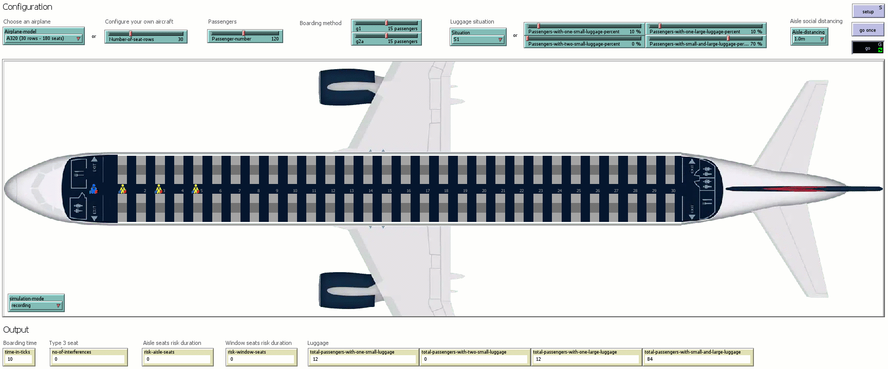
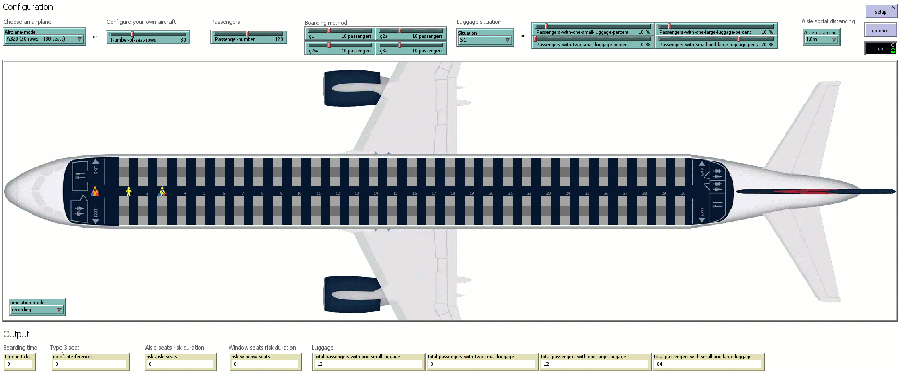
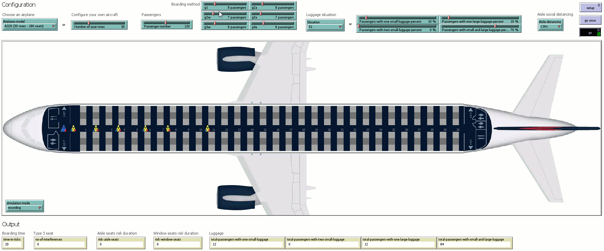
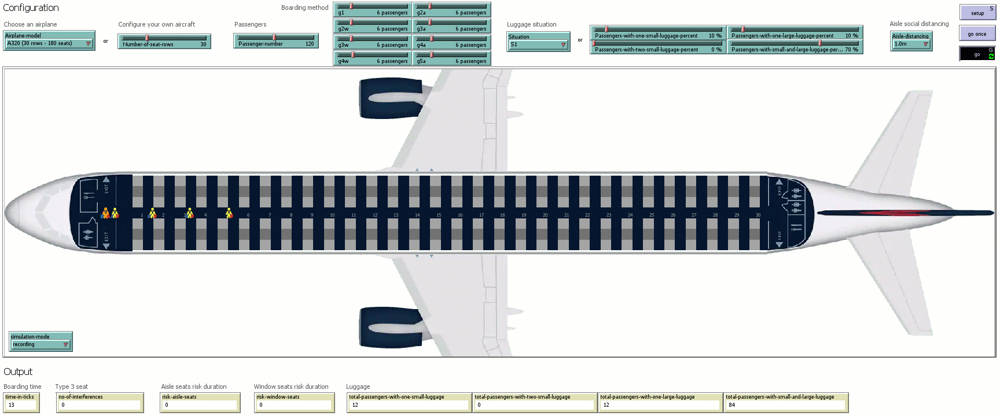
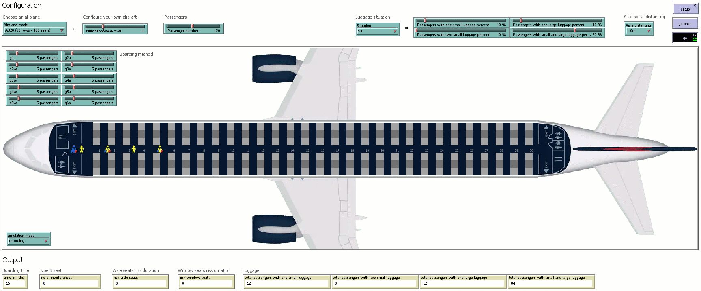
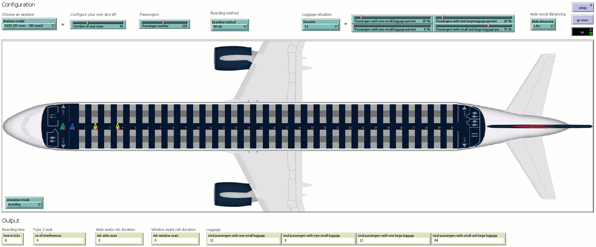

Recordings of the simulations presented in the paper
### **"Minimizing Health Risks as a Function of the Number of Airplane Boarding Groups"** 
published in the `Transportmetrica B` journal: https://www.tandfonline.com/doi/abs/10.1080/21680566.2021.1968322

Please feel free to contact us at liviu.cotfas at ase .ro for further details. 

## Boarding Situations

All the simulation recordings have been performed using the following settings:
- occupancy level: all aisle and window seats are occupied (120 passengers);
- luggage situation: S1;
- aisle social distance: 1m.

> Suggestion: You can download the animations below in order to watch them at a higher resolution.

### 1. RP-3

### 2. RP-4

### 3. RP-5

### 4. RP-6

### 5. RP-7

### 6. RP-11

### 7. RP-16

### 8. RP-31

### 9. RP-60

